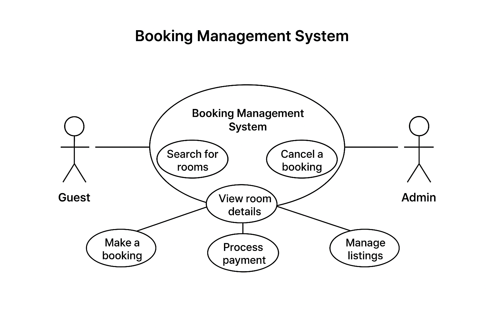

# Requirement Analysis in Software Development

## Introduction
This repository focuses on **Requirement Analysis**, an essential phase in the **Software Development Life Cycle (SDLC)**. It helps identify what a system must do and ensures that all stakeholders share a common understanding of the system’s objectives, features, and constraints. The goal of this repository is to explain the importance, process, and practical aspects of requirement analysis in software projects.

---

## What is Requirement Analysis?
**Requirement Analysis** is the process of understanding and documenting the needs and expectations of stakeholders for a software system. It ensures that developers and clients have a shared vision of what should be built before actual development begins.

In the SDLC, this stage bridges the gap between business needs and technical solutions. It involves gathering, analyzing, and validating requirements to create a clear roadmap for design and implementation.

Key benefits include:
- Reducing misunderstandings and scope creep.
- Ensuring that final software meets user needs.
- Providing a solid foundation for design and testing.

---

## Why is Requirement Analysis Important?
Requirement Analysis is critical to the success of any software project. It helps to:

1. **Prevent Miscommunication:** Aligns developers, stakeholders, and clients on the project’s objectives and expected outcomes.
2. **Reduce Costs and Time:** Detects issues and inconsistencies early, preventing costly rework later in development.
3. **Improve Quality:** Ensures that all functional and non-functional aspects are properly defined, leading to a reliable and high-performing system.

---

## Key Activities in Requirement Analysis
The process of Requirement Analysis includes several important activities:

- **Requirement Gathering:** Collecting initial user needs through interviews, questionnaires, or observation.
- **Requirement Elicitation:** Engaging stakeholders to uncover hidden needs, priorities, and constraints.
- **Requirement Documentation:** Recording requirements in a structured, traceable format such as a Software Requirement Specification (SRS).
- **Requirement Analysis and Modeling:** Evaluating, refining, and representing requirements using diagrams or models for better understanding.
- **Requirement Validation:** Ensuring requirements are correct, complete, and feasible through stakeholder reviews and testing.

---

## Types of Requirements

### 🟦 Functional Requirements
Functional requirements define **what the system should do** — the specific features or actions that fulfill user needs.

**Examples (Booking Management System):**
- Users can create, modify, and cancel bookings.
- The system allows customers to search for available rooms by date and location.
- Admins can manage property listings and update room availability.
- The system sends confirmation emails upon successful booking.

### 🟨 Non-functional Requirements
Non-functional requirements specify **how the system should perform** — focusing on qualities and performance attributes.

**Examples:**
- The system must handle at least 10,000 concurrent users.
- Page load time should not exceed 3 seconds.
- The application should be responsive and accessible on mobile and desktop.
- The system must ensure 99.9% uptime reliability.

---

## Use Case Diagrams
**Use Case Diagrams** visually represent interactions between system users (actors) and the system’s functionalities (use cases). They help stakeholders understand how users will interact with the system.

### Benefits of Use Case Diagrams:
- Simplify communication between technical and non-technical stakeholders.
- Provide a clear overview of system scope.
- Help identify user roles and system functionalities early.

### Example: Booking Management System
Actors:
- **Guest** – Searches rooms, books, and makes payments.
- **Admin** – Manages listings, views reports, and monitors bookings.

**Use Cases:**
- Search for rooms
- View room details
- Make a booking
- Cancel a booking
- Process payment
- Manage listings
- Generate reports

---

## Acceptance Criteria
**Acceptance Criteria** define the specific conditions under which a software feature is considered complete and acceptable to stakeholders. They provide measurable checkpoints to verify that the feature meets business and user expectations.

### Importance:
- Ensure clarity between developers and clients.
- Help in defining test cases.
- Support transparent and objective validation of features.

### Example: Checkout Feature (Booking Management System)
**Acceptance Criteria:**
- The user must be able to review booking details before confirming payment.  
- The system must successfully process payments via available gateways.  
- Upon successful payment, a booking confirmation email must be sent to the user.  
- The system must update room availability immediately after checkout.  
- If payment fails, the system should display an appropriate error message.

---

## Manual Check
Before submission, ensure the following:
- All required sections are correctly formatted and present.
- The file `alx-booking-uc.png` is added to your repository.
- The diagram link displays properly in the README.
- Your commits and pushes to GitHub are successful.

---
